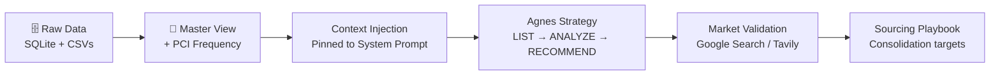

# Agnes — The Sourcing Intelligence Engine

> **Agnes sees the supplier patterns your procurement team can't — turning fragmented BOMs into a single, defensible sourcing strategy.**

Agnes is a long-context AI sourcing advisor that reads your entire supply chain at once, surfaces hidden consolidation opportunities, and validates them against live market intelligence. Built for global reasoning; engineered for strategic impact.

---

## Impact at a Glance
* **Visibility:** 100% of Relational Sourcing Data mapped into a single, denormalized view.
* **Intelligence:** Structural Criticality calculated via the **Part Commonality Index (PCI)**.
* **Speed:** From raw SQL to a Sourcing Strategy in < 10 seconds.
* **Reasoning:** Zero-shot pattern recognition across a **2M token context window**.

---

## The "Why" — Fragmented Sourcing is a Silent Tax

Every mid-sized manufacturer loses millions to the same invisible problem:
* **SKU Proliferation:** The same raw material is purchased from **3, 5, or 10 different suppliers** across different product lines because data is siloed.
* **Single Points of Failure:** Critical components feeding 40% of production are often sourced from exactly one supplier in a high-risk geography.
* **Local Optimization:** Procurement teams optimize per-product, while the **global pattern** — the one that unlocks real volume leverage — stays invisible.

---

## The Approach — Long-Context Over RAG

Traditional AI tools use RAG (Retrieval-Augmented Generation), which only shows the AI small "snippets" of data. Sourcing decisions require **global context**, so we built a different architecture:

### 1. Master Sourcing View (The Denormalization Layer)
We join six relational tables — `Company`, `Product`, `Supplier`, `Supplier_Product`, `BOM`, and `BOM_Component` — into a single "Master View." Every row represents a unique relationship between a finished good and its raw components.

### 2. Context Injection (The Reasoning Primitive)
Instead of searching for rows, we **pin the entire Master View into the AI’s system instruction.** Using the 2M-token window of Gemini, Agnes reasons over the complete dataset simultaneously, identifying cross-category patterns that standard search-based AI would miss.

### 3. The PCI Index (Part Commonality Index)
We engineered a structural metric to solve the lack of volume data:
> **`BOM_Frequency`**: The number of distinct finished products that depend on a specific raw material.

| Pattern | Interpretation |
| :--- | :--- |
| **High Frequency + Multiple Suppliers** | **Fragmentation Red Flag** — Immediate consolidation candidate. |
| **High Frequency + One Supplier** | **Resilience Risk** — Strategic priority for second-source qualification. |

### 4. Agentic Market Validation
Internal data tells you *what to do*; the market tells you *how to do it*. Agnes uses live web grounding to suggest functional substitutes and assess geopolitical risks for identified suppliers.

---

## The Workflow



---

## ⚡ Technical "Unlocks"

These are the bets that make Agnes qualitatively different from a standard RAG chatbot:

- **Gemini's 1M–2M Token Window as a Database.** We treat long context not as "bigger RAG" but as a **primitive for global reasoning**. The entire Master View lives in the system prompt — meaning Agnes reasons over relationships, not passages.
- **Frequency as a Proxy for Volume.** Without quantity/spend data, volume-based criticality is impossible. `BOM_Frequency` — a graph-topology metric — becomes a **structural proxy for strategic importance**. It's cheap, deterministic, and surprisingly predictive.
- **Deterministic Reasoning Protocol.** Agnes is pinned to a **LIST → ANALYZE → RECOMMEND** response shape. No hallucinated SKUs, no vague strategy — every recommendation is traceable to a row in the Master View.
- **Data-Source Priority Rule.** Internal data is authoritative for SKU-level questions; web search is gated to market/regulatory questions the local view cannot answer. This prevents the classic agent failure mode of "fabricated facts grounded in a search result."
- **Hybrid Model Strategy.** Gemini 2.5 Pro for strategic reasoning; Gemini 2.5 Flash for compliance comparison / structured extraction — matching model capability to task cost.

---

## From Handwritten Logic to Production Code

The [Master Sourcing View](rag.py#L88-L152) join logic wasn't pulled from a library — it started as **handwritten schema notes** mapping foreign keys between `BOM`, `BOM_Component`, `Supplier_Product`, and `Product`. Those notes became the literal blueprint for `load_master_view()`:

- Handwritten step 1: *"collapse Supplier_Product → suppliers-per-product"* → [rag.py:98-106](rag.py#L98-L106)
- Handwritten step 2: *"enrich Product with Company + Supplier list"* → [rag.py:108-115](rag.py#L108-L115)
- Handwritten step 3: *"self-join as Produced / Consumed sides of BOM"* → [rag.py:117-141](rag.py#L117-L141)
- Handwritten step 4: *"compute frequency across ConsumedSKU"* → [rag.py:143](rag.py#L143)

The handwritten logic is the contract; the code is the implementation. Screenshots of the notes are included in the hackathon submission.

---

## 🛠️ Installation & Running

### 1. Clone & enter the project
```bash
git clone https://github.com/SyedZainAnwer/Supply-Chain-Agent.git
cd Supply-Chain-Agent
```

### 2. Create a virtual env and install deps
```bash
python -m venv venv
source venv/bin/activate        # Windows: venv\Scripts\activate
pip install -r requirements.txt
```

### 3. Configure your `.env`
Create a `.env` file at the project root:
```env
GOOGLE_API_KEY=your_gemini_api_key_here
TAVILY_API_KEY=your_tavily_api_key_here   # optional, for compliance comparison
```

### 4. Verify the database
The SQLite database ships at [db/db.sqlite](db/db.sqlite). CSV exports live in [csv_exports/](csv_exports/) for inspection.

### 5. Launch Agnes
```bash
streamlit run rag.py
```

Open the URL Streamlit prints (typically `http://localhost:8501`). Toggle **Enable Google Search tool** in the sidebar to unlock live market validation.

### Optional: Explore the supply chain graph
```bash
python app.py             # prints node/edge diagnostics
python db_visualize.py    # regenerates supply_chain_graph.html
```

---

## Try These Prompts

- *"Which raw materials are our highest consolidation priorities?"*
- *"Show me the single-source risks ranked by criticality."*
- *"Find functional substitutes for our most fragmented component — and check if any of the current suppliers have recent compliance issues."*
- *"If we had to cut our supplier count by 30%, which ones would you drop and why?"*

---

## Project Structure

| File | Purpose |
|---|---|
| [rag.py](rag.py) | Agnes — the main Streamlit app; long-context sourcing agent |
| [app.py](app.py) | SQLite → NetworkX graph builder (diagnostics + graph primitive) |
| [db_visualize.py](db_visualize.py) | Interactive supply-chain graph (pyvis HTML export) |
| [compliance_compare.py](compliance_compare.py) | Supplier compliance comparison via Tavily + Gemini Flash |
| [to_csv.py](to_csv.py) | SQLite → CSV exporter for offline inspection |
| [db/db.sqlite](db/db.sqlite) | Source of truth: Products, BOMs, Suppliers |

---

## The Vision

Agnes is a hackathon prototype, but the thesis is durable: **procurement is a pattern-recognition problem, and long-context models are pattern-recognition machines.** The bottleneck in sourcing strategy was never retrieval — it was ever having the whole map in one place. Now we do.

The next time a CPO asks *"where are we bleeding money in sourcing?"* — the answer shouldn't take a consulting engagement. It should take one question.
